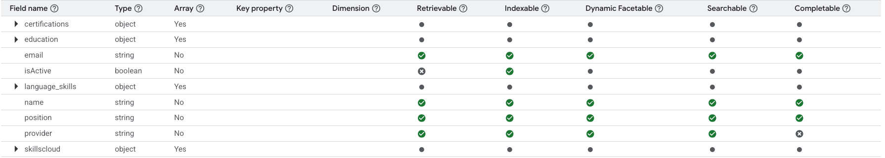
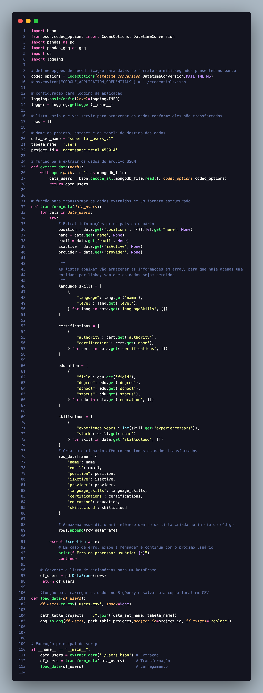

# Integração do BigQuery com o Agent Space

## Introdução

Esta documentação descreve o processo completo de processamento e carregamento de dados no **BigQuery** — o data warehouse corporativo da Google Cloud — e seu consumo por meio do **Agent Space**.

Serão detalhadas todas as etapas, desde o processo de **ETL (Extract, Transform, Load)** até a utilização dos dados pela ferramenta Agent Space para consultas semânticas.

Para este caso de uso específico, foram exportados dados de uma plataforma interna chamada **Superstar**, que contém informações sobre os profissionais da empresa, incluindo habilidades, certificações obtidas, experiências de trabalho, entre outros. A exportação foi realizada no formato **.bson** (formato binário utilizado pelo MongoDB) e transformados utilizando Python, estruturando-os de uma maneira mais adequada antes de serem carregados no BigQuery.

## Serviços GCP

### BigQuery
O BigQuery é um serviço de armazenamento e análise de dados (Big data) da Google (também conhecido como data warehouse) sem servidor que pode ser escalonado de acordo com seus dados. 

Entenda esse serviço como um banco de dados de banco de dados, permitindo conectar diversas fontes de dados e centralizar as informações. 

O BigQuery pode armazenar petabytes de dados, o que o torna ideal para empresas que trabalham com grandes conjuntos de dados. Esses dados são armazenados de forma organizada em tabelas, permitindo análises estruturadas (oferecendo suporte a consultas utilizando o SQL).

Também é possível analisar petabytes de dados usando velocidades incrivelmente rápidas sem sobrecarga operacional

### Cloud Storage
Cloud Storage é o serviço de armazenamento de objetos da GCP, conhecido como Data Lake. Ele permite armazenar arquivos de qualquer tipo e tamanho, como imagens, vídeos, backups, dados brutos, arquivos CSV, JSON etc.

O Cloud Storage funciona como um sistema de arquivos e pastas no Windows. Tenho o diretório raiz, onde posso criar pastas e sub pastas e armazenar qualquer tipo de arquivos.

> Embora o modelo de 'pastas' no Cloud Storage seja apenas ilustrativo — já que na prática tudo funciona por meio de paths (caminhos) — ele ajuda na compreensão e organização visual dos arquivos.

O Cloud Storage armazena os objetos dentro de Buckets, que pode ser entendido como uma espécie de “caixa” onde os arquivos (objetos) são armazenados em nuvem. Cada bucket é isolado um do outro, cujo nome deve ser único e global. Os buckets podem ser regionais ou multi-regionais

### gcloud
O gcloud é a ferramenta de linha de comando oficial da GCP, permitindo interagir com os recursos via terminal. 

Quando você está desenvolvendo em ambiente local (como seu computador) e quer usar SDKs da GCP (ex: BigQuery, Storage, etc.) é necessário credenciais válidas.

Ao executar o comando ```gcloud auth application-default login```, as credenciais da conta ativa são armazenadas localmente como padrão, permitindo que os SDKs do Google acessem essas credenciais a partir de um caminho padrão, como:
```
~/.config/gcloud/application_default_credentials.json
```

Alguns outros comandos incluem:
```sh
gcloud auth login #Autentica o terminal (CLI) com sua conta Google
gcloud auth application-default login #Autentica o ambiente local para uso com bibliotecas (SDKs) como Python, Node.js, etc.
gcloud config set project [ID_DO_PROJETO] #Define qual projeto será usado como padrão nos comandos gcloud.
gcloud config get-value project #Mostra qual projeto está atualmente configurado no ambiente local.
gcloud auth list #Lista todas as contas autenticadas no ambiente local 
gcloud config set account [account] #Define a conta ativa no ambiente local para comandos gcloud
gcloud config list #Exibe todas as configurações ativas
```

## Escopo do caso de uso

- **Fonte de dados:** BigQuery
- Ferramentas utilizadas
    - **Python:** linguagem de programação escolhida  
    - **Pandas:** ferramenta de processamento e tratamento de dados  
    - **pandas_gbq:** biblioteca que integra o pandas com o BigQuery, facilitando a ingestão e leitura de dados  
    - **gcloud:** ferramenta de linha de comando oficial da GCP, utilizada para realizar a autenticação com o console e ter acesso ao BigQuery  

## Pré-requisitos

- Instalação da linguagem de programação
    - [https://www.python.org/](https://www.python.org/) → link para a instalação do Python
- Criação de um ambiente virtual
    - execute o comando ```python3 -m venv env``` -> irá criar um ambiente virtual chamado **env**. O nome é opcional
    - Após criado o ambiente virtual, acesse-o executando o seguinte comando:
        - No linux: ```source env/bin/activate```
        - No windows (cmd): ```env/Scripts/activate.bat```
        - No windows (PS): ```env/Scripts/activate.ps1```
- Instalação das ferramentas necessárias dentro do ambiente virtual
    ```bash
    pip3 install pandas pandas-gbq google-cloud-bigquery
    ```
- Instalação do gcloud
    - Siga o passo a passo dessa documentação:  
    - [https://cloud.google.com/sdk/docs/install#windows](https://cloud.google.com/sdk/docs/install#windows)
- Autenticação com o Google através do gcloud
    - Execute o utilitário da seguinte forma em seu terminal: 
        ```bash
        gcloud auth application-default login
        gcloud config set project 'agentspace-trial-na'
        ```
    - Selecione o e-mail da AvenueCode, que possui as devidas permissões dentro da GCP
    - A partir desse ponto, podemos usar as credenciais de usuário para estabelecer a conexão entre o ambiente local e a GCP
- Caso de uso em mente
    - Como será feita a extração desses dados e se é possível
        - Via api? Bulk de dados?
    - O quanto esses dados terão de ser transformados
        - Qual o nível que esses dados se encontram?
            - Bronze -> dados brutos.
            - Silver -> dados brutos, porém parcialmente tratados.
            - Gold -> dados tratados e pronto para uso. 
    - Qual a massa de dados (tamanho - GiBs) que será usada

## Importante

O **Agent Space** é uma ferramenta que, ao realizar a busca dentro do Data Store, opera por meio de **busca semântica**, e não por meio de query SQL.  
Por essa razão, recomenda-se **uma linha por entidade**.  

Caso haja mais de uma linha por entidade dentro do dataset, é recomendado o uso de **arrays**, como no exemplo abaixo:

### Tabela original

| ID | Nome  | Produto   | Categoria  | Preço   | Data       |
|----|-------|-----------|------------|---------|------------|
| 1  | Ana   | Camiseta  | Vestuário  | 49.90   | 2024-01-15 |
| 1  | Ana   | Tênis     | Calçado    | 199.90  | 2024-02-10 |
| 1  | Ana   | Mochila   | Acessório  | 89.90   | 2024-03-05 |
| 2  | Bruno | Notebook  | Eletrônico | 2999.00 | 2024-01-20 |
| 2  | Bruno | Mouse     | Periférico | 79.90   | 2024-02-01 |
| 3  | Carla | Livro     | Cultural   | 39.90   | 2024-03-11 |

### Tabela tratada

| cliente_id | nome  | produto                              | categoria                          | valor                | data_compra                                 |
|------------|-------|--------------------------------------|------------------------------------|----------------------|----------------------------------------------|
| 1          | Ana   | ["Camiseta", "Tênis", "Mochila"]     | ["Roupas", "Calçados", "Acessório"]| [49.9, 199.9, 89.9]  | ["2024-01-15", "2024-02-10", "2024-03-05"]   |
| 2          | Bruno | ["Notebook", "Mouse"]                | ["Eletrônico", "Periférico"]       | [2999.0, 79.9]       | ["2024-01-20", "2024-02-01"]                 |
| 3          | Carla | ["Livro"]                            | ["Cultura"]                        | [39.9]               | ["2024-03-11"]                               |

## Descrição

Para este caso de uso:

1. Os dados foram exportados manualmente do **MongoDB** no formato `.bson`.
2. Em seguida, utilizou-se **Python** para realizar a transformação dos dados, conforme as recomendações definidas previamente.
    - Os dados, que estavam originalmente em formato desestruturado (bson), foram transformados em um formato estruturado e tabular (dataset).
    - Os dados dentro do dataset foram tratados conforme as boas práticas de engenharia de dados, como a padronização de formatos, tratamento de valores ausentes, normalização de campos e validação de consistência entre registros.
    - Os dados que se repetiam por entidade foram consolidados em arrays por campo seguindo as recomendações previamente definidas acima.
3. A autenticação e o gerenciamento de permissões foram realizados com a ferramenta **gcloud**, utilizando as credenciais do usuário responsável.
    - ```gcloud auth application-default login``` para realizar a autenticação
4. Após as transformações, os dados foram carregados no **BigQuery** utilizando a biblioteca `pandas-gbq` para ingestão.
5. Para a criação do DataStore, foi definido o esquema dos dados, incluindo tipos de campo, propriedades de indexação, se o campo é um array, e outras características importantes para otimização de consultas e busca.
    - As principais propriedades configuradas no DataStore são:
        - **Field name**: nome do campo.
        - **Type**: tipo de dado (string, integer, boolean, etc).
        - **Array**: indica se o campo é uma lista de valores.
        - **Key property**: indica se o campo é chave primária, útil para apresentação dos resultados e síntese de conteúdo
        - **Dimension**: O campo dimension é para tipos de dados vetoriais, usados para buscas semânticas baseadas em embeddings (representações numéricas de texto ou objetos).
        - **Retrievable**: permite que o campo seja retornado nas consultas.
        - **Indexable**: permite que o campo seja indexado para buscas eficientes.
        - **Dynamic Facetable**: permite criar facetas dinâmicas (filtros dinamicos) para filtragem.
        - **Searchable**: permite que o campo seja pesquisado via texto.
        - **Completable**: habilita sugestões automáticas (autocomplete).
        
6. O AgentSpace é o ambiente de consulta semântica que utiliza o DataStore como base para responder perguntas e realizar buscas. Para criar o AgentSpace, é necessário referenciar o DataStore criado, vinculando-o ao AgentSpace para que as consultas sejam realizadas sobre os dados indexados.
    - O AgentSpace não executa queries diretamente no BigQuery; em vez disso, ele utiliza o DataStore para realizar buscas otimizadas, combinando técnicas de NLP e indexação.

### Código Python



Para acessar o código de referência, <a href="./main.py">clique aqui</a>